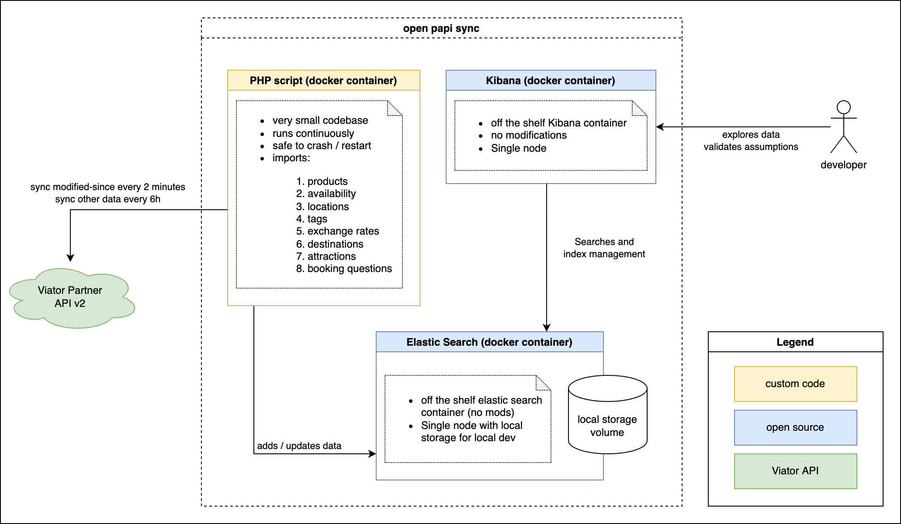

# Viator Data Synchronizing container

# Overview

The purpose of this project is to help people explore and rapidly prototype using Viator Partner API. 

This project synchronises Viator product catalogue to a local instance of Elastic Search. It is meand for startup-like prototyping, exploration and content analysis rather than production use. It also provides some examples of how api can be used and what precautions you may want to take.

Sinchroniser pulls products, tags, destinations, attractions, schedules, exchange rates, booking questions and locations on its initial run and continously updates the catalogue using modified-since endpoints. Initial run takes a long time (18-24h per language) as all data is being pulled. Following runs are very quick as only updates are being pulled.

Script checks for updates every 2 minutes and regreshes tags, destinations and attractions twice a day.

Localised content is split into separate indices based on locale and non-localised content has one index per content type.

We store original object recieved from Viator Partner API in elastic search (in the _source" field) so you can expect the same object model. The only exception is addition of "_sync_annotations" field to product object to track sync metadata.

# Contents

This project consists of:
- A small library of PHP code which can continously synchronise data provided by Viator API into local Elastic Search. 
- Docker configuration which spins up an instance of locally deployed Elastic Search as a sole data store.
- Docker configuration which spins up a Kibana instance to allow exploration of data via UI.

# Running all three containers locally (tested on mac)

You need to build the image locally and set configuration variables before running docker-compose up

In example below we store our API key in a local file dev.api.key (in the same folder as docker-compose.yml). This way we dont need to modify commands to prevent copy pasting api keys.

    composer upgrade

    docker build -t viator-sync .

    export VIATOR_API_KEY=`cat dev.api.key`
    export VIATOR_API_HOST_PREFIX='https://api.sandbox.viator.com/partner'
    export VIATOR_ES_URL='http://elasticsearch:9200'
    export VIATOR_LOCALES='en'

    docker-compose up -d

Observing logs

    docker-compose logs -f viator-sync

Observing HTTP traffic debug log

    docker exec -it viator-sync tail -f /usr/src/viatorsync/debug.log

What it does:
- builds the image
- sets configuration in env variables
- creates a local docker volume to store elasticsearch data (only on first run, later volume is reused)
- creates local bridged network so that containers can see each other  (only on first run)
- starts all three containers up in an interactive mode 

You will see errors from viator-sync container at the start as elastic search needs half a minute to boot up. Once it starts the syncronisation script will start work.

You can then go to http://localhost:5601/ and import saved objects. 

Dashboard will show you errors throughout the first sync run as indices are create on the fly as the first import executes.

Initial import of strict highest-quality products (~65K of them as of Feb 2022) can take 18-24h using sandbox environement. It may depend on your network speed as well as there are a few GB of json data to be transferred.

# Other useful commands

Tail logs of the synchroniser (it starts every 2 minutes by default)

    docker-compose logs -f viator-sync

Stop all of the containers

    docker-compose stop

# How to import Kibana saved objects

There are some index patterns, saved searches and dashboard you may like. If you use local kibana and elastic search there is no reason not to import them.

Go to index management http://localhost:5601/app/management/kibana/objects

Click import (right top) select file ./kibana/export.ndjson

Then navigate to the synchroniser dashboard to see how import is progressing http://localhost:5601/app/dashboards#/view/2501bf00-92da-11ec-b68e-69449a19fa49?_g=(filters:!(),refreshInterval:(pause:!t,value:0),time:(from:now-1h,to:now)) 

Example saved search for accepted products in English http://localhost:5601/app/discover#/view/8c8de2a0-889b-11ec-b6cf-279f26999fac

You can explore other saved searches by clicking "open" on the right hand side of the discover tab.

Note: during the initial import you may see errors in kibana as saved objects refer to indices which may not exist yet. As job finishes all indices will be created and errors will go away.

# Other notes

Running elastic search locally in interactive mode and "crashing" it may cause some data loss, if you want to reduce risk of missing information you could kill the synchroniser container first before stopping ES and Kibana.

# Disclaimer

This is not a production ready code and you are using it at your own risk.

# Running scripts locally outside docker

If you want to run a script on mac without docker you may need to change config slightly

    export VIATOR_API_KEY=`cat dev.api.key`
    export VIATOR_API_HOST_PREFIX='https://api.sandbox.viator.com/partner'
    export VIATOR_ES_URL='http://localhost:9200'
    export VIATOR_LOCALES='en'

    php scripts/export.php
